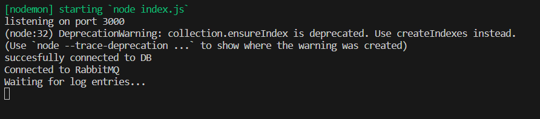

# Log Ingestor and Query Interface

This project implements a log ingestor system and a query interface. The system efficiently handles vast volumes of log data and provides a simple interface for querying data using full-text search or specific field filters.

## Table of Contents

- [Log Ingestor and Query Interface](#log-ingestor-and-query-interface)
  - [Log Ingestor](#log-ingestor)
  - [Query Interface](#query-interface)
- [Getting Started](#project-setup)
  - [Prerequisites](#prerequisites)
  - [Installation](#installation)
- [Limitations and Known Issues](#limitations-and-known-issues)

# Log Ingestor and Query Interface

This project implements a log ingestor and a query interface in Node.js using an Express server.

## Components and Technologies Used

### Log Ingestor

- **Node.js and Express Server:**
  - Handles incoming requests and manages responses.
  
- **RabbitMQ Message Queue:**
  - Logs are forwarded to a message queue upon receipt.
  - A subscriber consumes these logs and writes them to the database.

- **MongoDB (Sharded):**
  - Efficiently manages vast amounts of log data.
  - Sharded MongoDB with 3 config servers and 2 shards for scalability.
  - Timestamps are indexed to optimize write performance.

### Load Balancing

- **Nginx:**
  - Load balances multiple Node.js servers to handle requests at scale.
  - Distributes incoming requests to different instances of the Node.js app.

## Query Interface Usage


### Using HTML Form

Access the HTML form at [http://localhost:3000/](http://localhost:3000/) to conveniently input queries and retrieve results.

### Using GET Requests

Make GET requests to [http://localhost:3000/log](http://localhost:3000/log) with appropriate parameters to query the log data. You can use tools like Postman or Thunder Client for this purpose.

Example GET request parameters:

- `http://localhost:3000/log?level=error`
- `http://localhost:3000/log?message=Failed%20to%20connect`
- `http://localhost:3000/log?resourceId=server-1234`

Adjust the parameters based on the specific log attributes you want to filter or search.

### Docker and Docker Compose

- **Containerization:**
  - Docker is used to manage different images and containers.
  - Docker Compose simplifies multi-container Docker applications.


## Components and Technologies Used

### Log Ingestor

- **Node.js and Express Server:**
  - Handles incoming requests and manages responses.
  
- **RabbitMQ Message Queue:**
  - Logs are forwarded to a message queue upon receipt.
  - A subscriber consumes these logs and writes them to the database.

- **MongoDB (Sharded):**
  - Efficiently manages vast amounts of log data.
  - Sharded MongoDB with 3 config servers and 2 shards for scalability.
  - Timestamps are indexed to optimize write performance.

### Load Balancing

- **Nginx:**
  - Load balances multiple Node.js servers to handle requests at scale.
  - Distributes incoming requests to different instances of the Node.js app.

### Query Interface

- **HTML Form:**
  - Implemented at `localhost:3000/` for user-friendly interaction.

### Docker and Docker Compose

- **Containerization:**
  - Docker is used to manage different images and containers.
  - Docker Compose simplifies multi-container Docker applications.

## Project Setup

### Prerequisites

- Docker


## Installation

To run the log ingestor and query interface, you need Docker installed on your system. If you don't have Docker installed, follow the instructions provided [here](https://docs.docker.com/get-docker/) to install Docker for your operating system.

1. **Clone the repository:**
    ```bash
    git clone https://github.com/your-username/log-ingestor.git
    cd log-ingestor-query
    ```

2. **Start the containers:**
    ```bash
    docker-compose up -d --scale log-ingestor=2
    ```

   This command starts all the necessary containers. The `-d` flag runs the containers in the background, and `--scale log-ingestor=2` scales the log-ingestor service to two instances.

3. **Wait for the containers to be ready:**
    While the containers are starting up, the Node.js app connects to the database and RabbitMQ. You can verify their status by checking the logs using Docker Desktop or running the following command for each instance:
    ```bash
    docker logs -f log-ingestor-query-log-ingestor-1
    ```

    Replace `1` with `2` for the second instance.

    

4. **Interact with the System:**

   - **HTTP Requests:**
     - Make HTTP POST requests to the `/log` endpoint to submit logs.
     - Use HTTP GET requests at the same endpoint with various query parameters to retrieve logs.
     - Example GET request: `http://localhost:3000/log?level=error`
     - Experiment with different query parameters based on log attributes.

   
   

   - **Web UI:**
     - Access the web UI at [http://localhost:3000](http://localhost:3000) in your browser.
     - Enter log details for queries in the user-friendly interface.

        
        

5. **Stopping and Cleaning Up**
    
    To stop and bring down the Docker containers, you can use the following command:

    ```bash
    docker-compose down
    ```
    This command stops and removes the containers. If you want to also delete the volumes and remove all data stored in the database, you can use the -v flag:

    Caution: The -v flag deletes volumes, including the MongoDB data. Use this flag only if you want to start fresh and don't need to preserve any data in the database.

## Limitations and Known Issues

### Sharding Configuration

- The sharding setup is currently automated through a pre-configured MongoDB image by bitnami for simplicity and time efficiency.

### Container Startup Dependencies

- There might be instances where the Node.js container starts before the RabbitMQ or MongoDB containers are fully up. In such cases, the Node.js app may encounter connection issues.
  
- **Mitigation:**
  - Proper error handling is implemented, and the Node.js app will retry connecting to the containers until they are ready.
  - Users are advised to wait for the containers to be up before interacting with the system. Check container logs for status verification:

    ```bash
    docker logs -f log-ingestor-query-log-ingestor-1
    ```
    Replace `1` with `2` for the second instance.

### Initial Request Delay

- In some cases, the first request to the server might experience an unexpected delay.
  
- **Mitigation:**
  - Subsequent requests work smoothly. Currently I am investigating the issue but it does not seem to happen so often.

## Troubleshooting

If you encounter any issues or have questions, consider the following steps:

1. Check container logs for any error messages.
2. Ensure all required containers (RabbitMQ, MongoDB) are running and fully initialized.

